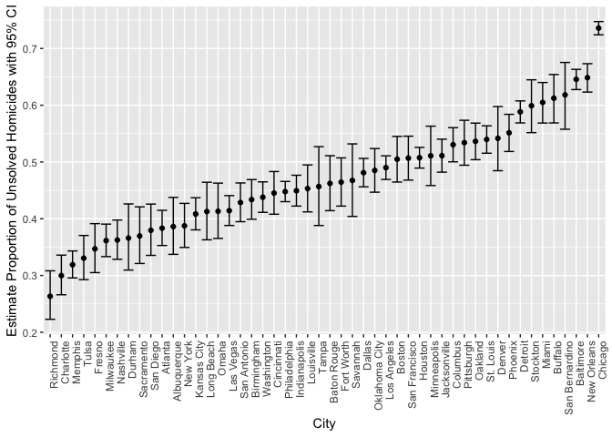

p8105\_hw5\_yw3236
================
Yishan Wang
2018-11-02

Problem 1
=========

Create a tidy dataframe containing data from all participants, including the subject ID, arm, and observations over time:

``` r
multmerge = function(mypath){

  filenames = list.files(path = mypath, full.names = TRUE)  #read file names as a list
  data = data_frame(filenames) %>%  #create a dataframe
    mutate(file_contents = purrr::map(filenames, function(x){read.csv(file = x, header = T)})) %>%  #read each file
    unnest()  #unnest each file
  
}
```

This is the second method that using for loop to create filenames column. (`eval=FALSE`)

``` r
multmerge = function(mypath){

  filenames = list.files(path = mypath, full.names = TRUE)  #read file names as a list
  datalist = purrr::map(filenames, function(x){read.csv(file = x, header = T)})  #read each csv file and store as a list
  names(datalist) = filenames
  names(datalist) = filenames
  for (i in filenames) {
   datalist[[i]]$filenames = i  #create a new column for file names
  }
  Reduce(function(x, y){rbind(x, y)}, datalist)  #combine all elements of the list

}
```

``` r
mergeddata = multmerge("./data")
```

``` r
format_merged_data = mergeddata %>%
  mutate(filenames = gsub("^./data/", " ", filenames)) %>%
  mutate(filenames = gsub(".csv$", " ", filenames)) %>%
  mutate(arm = gsub("([A-Za-z]+).*", "\\1", filenames)) %>%  #have arm column
  mutate(id = gsub("con_", " ", filenames)) %>%
  mutate(id = gsub("exp_", " ", id)) %>%
  mutate(id = as.numeric(id)) %>%  #have numeric id column
  select(-filenames) %>%
  gather(key = week, value = obs, week_1:week_8) %>%
  select(id, arm, week, obs) #tidy dataset

format_merged_data
```

    ## # A tibble: 160 x 4
    ##       id arm    week     obs
    ##    <dbl> <chr>  <chr>  <dbl>
    ##  1     1 " con" week_1  0.2 
    ##  2     2 " con" week_1  1.13
    ##  3     3 " con" week_1  1.77
    ##  4     4 " con" week_1  1.04
    ##  5     5 " con" week_1  0.47
    ##  6     6 " con" week_1  2.37
    ##  7     7 " con" week_1  0.03
    ##  8     8 " con" week_1 -0.08
    ##  9     9 " con" week_1  0.08
    ## 10    10 " con" week_1  2.14
    ## # ... with 150 more rows

Make a spaghetti plot showing observations on each subject over time:

``` r
format_merged_data %>%
  group_by(id) %>%  #group by id
  ggplot() +
  geom_line(aes(x = week, y = obs, group = id, color = id)) +
  facet_grid(~arm) +  #compare two groups: con and exp
  theme(axis.text.x = element_text(angle = 90, hjust = 1, size = rel(1))) +
  labs(x = "Week", y = "Observations")
```


### Comment

-   Observation values of experiment group are higher than the observation values of control group over time.

-   Experimental group has increasing trending, but control group stays relatively flat over time.

Problem 2
=========

### Describe Data

The variables `city`, `state`, and `disposition` in the raw dataset are important to analyze this problem. It also has location variables, such as `lat` and `lon`. Futhermore, the dataset includes victims' information. The dataset size is 52,179 \* 12.

``` r
homicides_data = read_csv("https://raw.githubusercontent.com/washingtonpost/data-homicides/master/homicide-data.csv")
```

    ## Parsed with column specification:
    ## cols(
    ##   uid = col_character(),
    ##   reported_date = col_integer(),
    ##   victim_last = col_character(),
    ##   victim_first = col_character(),
    ##   victim_race = col_character(),
    ##   victim_age = col_character(),
    ##   victim_sex = col_character(),
    ##   city = col_character(),
    ##   state = col_character(),
    ##   lat = col_double(),
    ##   lon = col_double(),
    ##   disposition = col_character()
    ## )

Create a city\_state variable and then summarize within cities to obtain the total number of homicides and the number of unsolved homicides:

``` r
summarised_homicides_data = homicides_data %>%
  mutate(city_state = paste(city, state, sep = ", ")) %>%
  mutate(disposition_index = ifelse(disposition == "Closed without arrest" | disposition == "Open/No arrest", 1, 0)) %>%  #create a index 
  group_by(city) %>%
  summarise(total_homicides = n(), unsolved_homicides = sum(disposition_index)) %>%  #summarize total homicides and unsolved homicides
  mutate(total_homicides = as.double(total_homicides))

summarised_homicides_data
```

    ## # A tibble: 50 x 3
    ##    city        total_homicides unsolved_homicides
    ##    <chr>                 <dbl>              <dbl>
    ##  1 Albuquerque             378                146
    ##  2 Atlanta                 973                373
    ##  3 Baltimore              2827               1825
    ##  4 Baton Rouge             424                196
    ##  5 Birmingham              800                347
    ##  6 Boston                  614                310
    ##  7 Buffalo                 521                319
    ##  8 Charlotte               687                206
    ##  9 Chicago                5535               4073
    ## 10 Cincinnati              694                309
    ## # ... with 40 more rows

For the city of Baltimore, MD, use the prop.test function to estimate the proportion of homicides that are unsolved:

``` r
baltimore_unsolved_homicides = summarised_homicides_data %>%
  filter(city == "Baltimore")  #filter Baltimore
  
baltimore_test = prop.test(baltimore_unsolved_homicides$unsolved_homicides, baltimore_unsolved_homicides$total_homicides)  #apply prop.test

broom::tidy(baltimore_test) %>%
  select(estimate, conf.low, conf.high)  #change test result to a dataframe
```

    ## # A tibble: 1 x 3
    ##   estimate conf.low conf.high
    ##      <dbl>    <dbl>     <dbl>
    ## 1    0.646    0.628     0.663

Now run prop.test for each of the cities in your dataset, and extract both the proportion of unsolved homicides and the confidence interval for each.

``` r
prop_test = function(city_data){
  
  city_data %>%
    nest(-city) %>%  #nest first
    mutate(test = purrr::map(data, ~prop.test(.x$unsolved_homicides, .x$total_homicides)),
           tidied = purrr::map(test, broom::tidy)) %>%  #apply test
    unnest(tidied, .drop = TRUE) %>%  #unnest
    select(city, estimate, conf.low, conf.high)
  
}
```

``` r
multicity_test = prop_test(summarised_homicides_data)

multicity_test
```

    ## # A tibble: 50 x 4
    ##    city        estimate conf.low conf.high
    ##    <chr>          <dbl>    <dbl>     <dbl>
    ##  1 Albuquerque    0.386    0.337     0.438
    ##  2 Atlanta        0.383    0.353     0.415
    ##  3 Baltimore      0.646    0.628     0.663
    ##  4 Baton Rouge    0.462    0.414     0.511
    ##  5 Birmingham     0.434    0.399     0.469
    ##  6 Boston         0.505    0.465     0.545
    ##  7 Buffalo        0.612    0.569     0.654
    ##  8 Charlotte      0.300    0.266     0.336
    ##  9 Chicago        0.736    0.724     0.747
    ## 10 Cincinnati     0.445    0.408     0.483
    ## # ... with 40 more rows

Create a plot that shows the estimates and CIs for each city:

``` r
multicity_test %>%
  ggplot() +
  geom_point(aes(x = reorder(city, estimate), y = estimate)) +  #order cities by the value of estimates
  geom_errorbar(aes(x = reorder(city, estimate), ymin = conf.low, ymax = conf.high, estimate)) +  #add error bar
  theme(axis.text.x = element_text(angle = 90, hjust = 1, size = rel(1))) +
  labs(x = "City", y = "Estimate Proportion of Unsolved Homicides with 95% CI")
```


